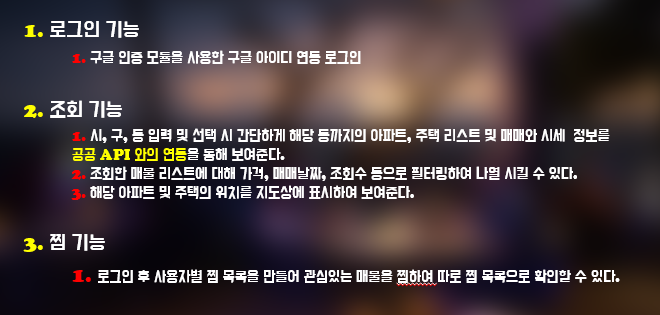

# How Much

## [프로젝트 주제 선정 동기]

- 아파트 및 주택 가격에 대해 예민해지고 있는 현재이다. 그렇지만 일반인에게는 아파트가 얼마에 팔렸었는지, 시세가 어느 정도인지 알기 위해서 많은 어려움을 동반했다.
- 이 점에 착안해 아파트 및 주택의 시세가 얼마였는지, 언제 팔렸는지 쉽게 알려주는 사이트를 만든다면 도움이 될 것이라고 생각한다.

## [목표]

- 간단히 클릭 몇 번만으로 원하는 시세 및 매매 정보를 보여주는 웹으로 편의성 및 심플함에 치중한 웹을 만드는 것을 목표로 한다.

---

## ▶ 핵심 기능

### ▷ Target 사용자

- 부동산 매물을 구입하려는 개인
- 부동산 시세를 확인하고 싶은 개인

---

---

## ▷ 예상 사용 시나리오

1. 시,구,동 을 선택한다.
2. 선택한 지역의 부동산 매물 리스트가 지도 및 텍스트 상으로 나타내어진다.
3. 원하는 매물을 선택하면 해당 매물의 시세 정보, 거래 내역, 시세 변동 추이 등의 정보가 화면에 나타나낟.
4. 해당 매물을 다음에 다시 보고 싶을 때 "로그인" 하고 매물을 찜하여 계정의 찜목록에 추가한다.

---

## [실행방법]

- 배포용 or 로컬 개발용 --> back_end/lib/host.js 파일과 front_end/src/lib/host.js 파일에 원하는 주소와 포트를 입력한다.
- front_end 에서 npm start 입력 + back_end 에서 npm start 를 입력한다.
- 단 back_end 의 경우 db 가 구축되어있지 않다면 에러가 발생한다. 이 경우 backup.sql 파일을 mysql 에 로드시켜 db를 구축한 뒤 실행시킬 수 있다.

---
